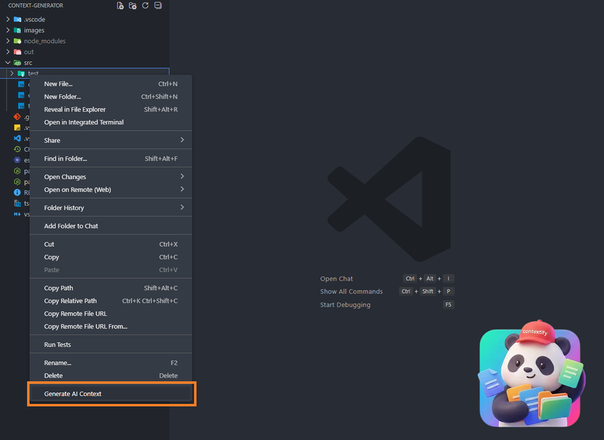

# Context Generator

A VS Code extension to generate context files for AI coding assistants (like ChatGPT or Claude).

## Features

- Right-click any folder in your Explorer.
- Select **"Generate Context"**.
- It creates a comprehensive text file containing the folder structure and file contents.
- Automatically respects `.gitignore` rules.
- Adds token count estimates.

## Usage

1. Open a folder in VS Code.
2. Right-click on a folder in the file explorer.
3. Click "Generate Context".
4. The result will open in a new panel, ready to copy/paste.

**Enjoy!**
